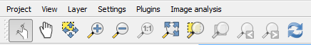
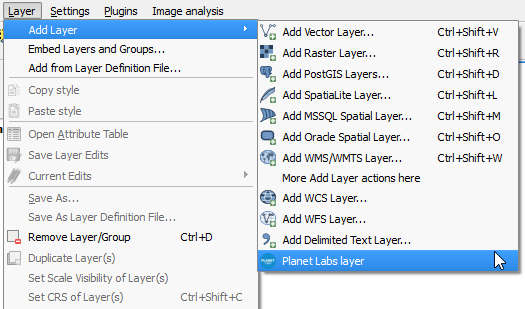

Profile files
--------------

A profile file contain all the elements needed to configure the QGIS interface according to a profile.

It's stored as a JSON file, with the following elements:

- panels: The names of panels to show, with their QT object names. These panels will be made visible. All other panels not listed here will be hidden. If not present, panels won't be altered.

- menus: Dict of menus to display. Menus are referred with their full path (including names of all parent menus) used as keys of the dict. Values are the name of the menu entry, to allow renaming of the menu item. If not present, menus won't be altered.

- buttons: Buttons to be displayed in the toolbar. Grouped by toolbars and referenced using their QT object name. If not present, toolbars won't be altered.

- plugins: names of plugins to activate. If a plugin is not installed, installation should be proposed to the user when changing. If plugins to activate add menu entries to the menu bar, those menu entries should be added to the *menus* list, otherwise they wont be shown. This is configured like this to alow having a plugin enabled, but only have certain menus from it available, or even no menus at all (so the plugin is only available for other plugins or to be used programatically)

For each json file in the ``userprofiles`` folder, a Profile object is created and registered, and a menu entry corresponding to that profile will be added to the *Profiles* menu. If your profile requires more than what the json file allows to configure, you can add a python file with code to be run when applying the profile.

To do that, just add a python file with the same name as the json file that contains the profile description, and add a function called ``apply`` to it. That function will be run when the profile is applied.

Profiles files (both json and python files) must be saved into the ``userprofiles`` folder, in order to be used by the profiles plugin.

Example
--------

In the ``userprofiles`` folder you will find examples of profiles. Here we will use one of them, the *image analysis* profile, to explain what it does and how that is implemented in the profiles files.

To activate the profile, you will find it under the *Settings/Profiles* menu.

The profile features a minimal set of menus and buttons, and focuses on providing tools for working with image data.

Only the map navigation toolbar is shown.

All panels are hidden, except for the layers list panel, to allow more space for the QGIS map canvas.

A menu named *Image analysis* is added, containing the tools from the OTB provider in Processing.

The Processing plugin itself is active, but its menus are hidden.

The Planet Labs catalog plugin is also added to the profile, but its menu (usually under the *Raster* menu) is also hidden. Instead, a menu entry under the *Layer/Add Layer* menu is added, for a better integration.

This changes are made using a python file as part of the profile, with the following code:

::

	def addProviderAsMenus(providerName, menuName):
	    provider = Processing.getProviderFromName(providerName)
	    for alg in provider.algs:
	        addAlgorithmEntry(alg.commandLineName(), menuName, alg.group)

	def apply():
	    addProviderAsMenus("otb", "Image analysis")
	    plugin = plugins["catalogpl_plugin"]
	    action = QAction(plugin.icon, "Planet Labs layer", iface.mainWindow())
	    action.triggered.connect(plugin.run)
	    addActionAt(action, "mLayerMenu/mAddLayerMenu")
